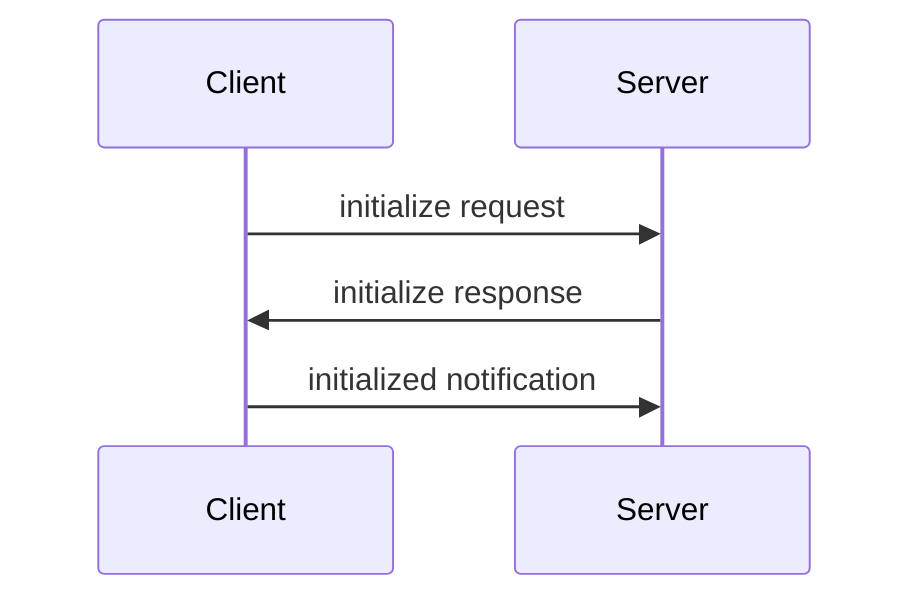
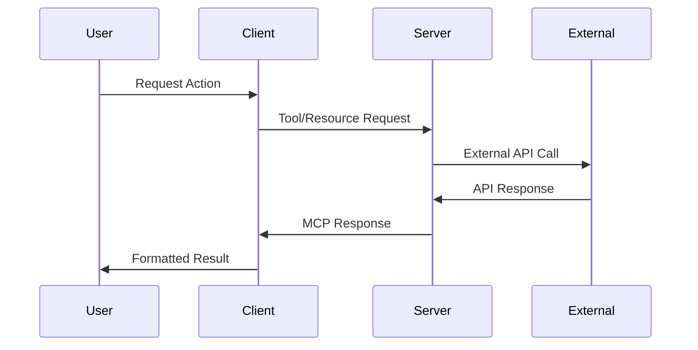
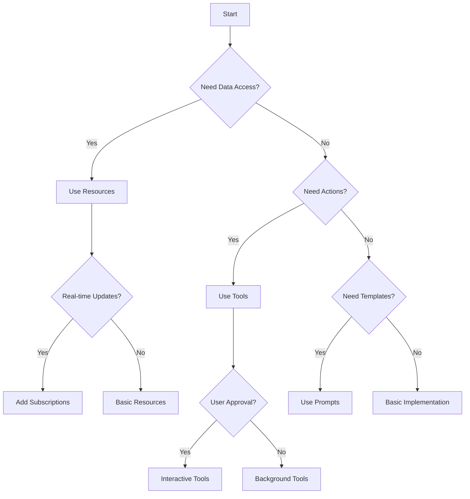
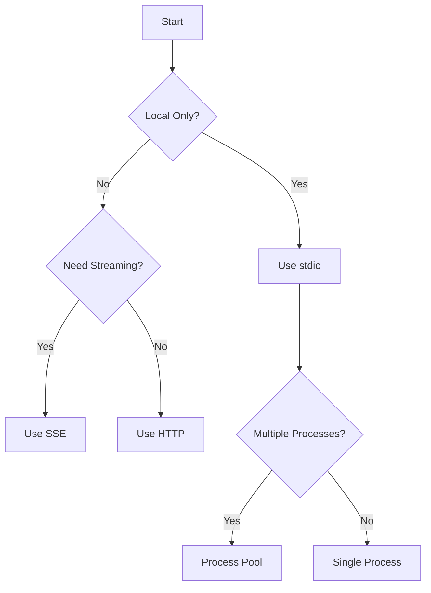

# Model Context Protocol (MCP) Guide for LLMs
`/Users/seanivore/Development/_setup-resources/for-llms-building-mcps/llms-dev-mcps-condensed.md`

## Table of Contents
1. [Overview](#overview)
2. [Core Architecture](#core-architecture)
3. [Protocol Essentials](#protocol-essentials)
4. [Common Patterns and Solutions](#common-patterns-and-solutions)
5. [Testing and Debugging](#testing-and-debugging)
6. [Essential Features](#essential-features)
7. [Implementation Patterns](#implementation-patterns)
8. [Best Practices](#best-practices)
9. [Advanced Topics](#advanced-topics)
10. [Getting Help](#getting-help)
11. [Client Integration Patterns](#client-integration-patterns)
12. [Real-world Integration Examples](#real-world-integration-examples)
13. [Advanced Integration Patterns](#advanced-integration-patterns)
14. [LLM Implementation Guide](#llm-implementation-guide)

## Overview
MCP is a protocol that standardizes how applications provide context to LLMs. It enables:
- Secure access to data and tools
- Standardized communication between LLMs and services
- Flexible integration with various data sources

## Core Architecture
- Hosts: LLM applications (Claude Desktop, IDEs)
- Clients: Protocol clients maintaining connections
- Servers: Programs exposing capabilities through MCP
- Transport: Communication via stdio or SSE

## Protocol Essentials

### Message Types and Formats

#### 1. Requests
```typescript
{
  jsonrpc: "2.0",
  id: number | string,
  method: string,
  params?: object
}
```
Example:
```json
{
  "jsonrpc": "2.0",
  "id": 1,
  "method": "resources/read",
  "params": {
    "uri": "file:///example.txt"
  }
}
```

#### 2. Responses
```typescript
{
  jsonrpc: "2.0",
  id: number | string,
  result?: object,
  error?: {
    code: number,
    message: string,
    data?: unknown
  }
}
```
Example:
```json
{
  "jsonrpc": "2.0",
  "id": 1,
  "result": {
    "contents": [{
      "uri": "file:///example.txt",
      "text": "File contents"
    }]
  }
}
```

#### 3. Notifications
```typescript
{
  jsonrpc: "2.0",
  method: string,
  params?: object
}
```
Example:
```json
{
  "jsonrpc": "2.0",
  "method": "notifications/resources/updated",
  "params": {
    "uri": "file:///example.txt"
  }
}
```

### Connection Lifecycle

1. **Initialization**


Example initialization:
```typescript
// Client initialization request
{
  "jsonrpc": "2.0",
  "id": 1,
  "method": "initialize",
  "params": {
    "protocolVersion": "1.0.0",
    "capabilities": {
      "resources": {},
      "tools": {},
      "prompts": {}
    }
  }
}

// Server response
{
  "jsonrpc": "2.0",
  "id": 1,
  "result": {
    "protocolVersion": "1.0.0",
    "capabilities": {
      "resources": {
        "supportsSubscriptions": true
      }
    }
  }
}
```

2. **Normal Operation**
- Request/response for operations
- Notifications for updates
- Progress reporting
- Error handling

3. **Termination**
- Clean shutdown via `close()`
- Resource cleanup
- Connection termination

### Error Handling

#### Standard Error Codes
```typescript
enum ErrorCode {
  ParseError = -32700,
  InvalidRequest = -32600,
  MethodNotFound = -32601,
  InvalidParams = -32602,
  InternalError = -32603
}
```

#### Error Response Example
```json
{
  "jsonrpc": "2.0",
  "id": 1,
  "error": {
    "code": -32602,
    "message": "Invalid parameters",
    "data": {
      "details": "Required parameter 'uri' missing"
    }
  }
}
```

## Common Patterns and Solutions

### Authentication and Authorization

#### Bearer Token Authentication
```typescript
const server = new Server({
  name: "authenticated-server",
  version: "1.0.0"
});

server.use(async (context, next) => {
  const token = context.request.headers.authorization;
  if (!token?.startsWith("Bearer ")) {
    throw new Error("Unauthorized");
  }
  await validateToken(token.slice(7));
  await next();
});
```

#### Resource Access Control
```python
@app.read_resource()
async def read_resource(uri: str) -> str:
    # Validate URI is within allowed paths
    if not is_path_allowed(uri):
        raise ValueError("Access denied")
        
    # Check user permissions
    if not await has_permission(current_user, uri, "read"):
        raise ValueError("Insufficient permissions")
        
    return await read_file(uri)
```

### Resource Caching

```python
from functools import lru_cache
from typing import Optional

class ResourceCache:
    def __init__(self):
        self.cache = {}
        self.watchers = set()

    @lru_cache(maxsize=100)
    async def get_resource(self, uri: str) -> Optional[str]:
        if uri in self.cache:
            return self.cache[uri]
        
        content = await fetch_resource(uri)
        self.cache[uri] = content
        return content

    async def invalidate(self, uri: str):
        self.cache.pop(uri, None)
        get_resource.cache_clear()
        await self.notify_watchers(uri)
```

### Subscription Management

```typescript
class SubscriptionManager {
  private subscriptions = new Map<string, Set<string>>();

  async subscribe(uri: string, clientId: string) {
    if (!this.subscriptions.has(uri)) {
      this.subscriptions.set(uri, new Set());
      await this.startWatching(uri);
    }
    this.subscriptions.get(uri)!.add(clientId);
  }

  async unsubscribe(uri: string, clientId: string) {
    const subs = this.subscriptions.get(uri);
    if (subs) {
      subs.delete(clientId);
      if (subs.size === 0) {
        this.subscriptions.delete(uri);
        await this.stopWatching(uri);
      }
    }
  }

  async notify(uri: string, event: any) {
    const subs = this.subscriptions.get(uri);
    if (subs) {
      for (const clientId of subs) {
        await this.sendNotification(clientId, uri, event);
      }
    }
  }
}
```

### Rate Limiting

```python
from datetime import datetime, timedelta
from collections import defaultdict

class RateLimiter:
    def __init__(self, limit: int, window: timedelta):
        self.limit = limit
        self.window = window
        self.counts = defaultdict(list)

    async def check_rate_limit(self, key: str) -> bool:
        now = datetime.now()
        self.counts[key] = [
            ts for ts in self.counts[key]
            if now - ts < self.window
        ]
        
        if len(self.counts[key]) >= self.limit:
            return False
            
        self.counts[key].append(now)
        return True

# Usage in server
rate_limiter = RateLimiter(limit=100, window=timedelta(minutes=1))

@app.tool()
async def rate_limited_tool():
    if not await rate_limiter.check_rate_limit("client_id"):
        raise ValueError("Rate limit exceeded")
    # Tool implementation
```

## Testing and Debugging

### Common Issues and Solutions

1. **Connection Problems**
```python
# Problem: Connection fails silently
# Solution: Add connection logging
async def connect_with_logging():
    try:
        transport = StdioServerTransport()
        await server.connect(transport)
        logger.info("Server connected successfully")
    except Exception as e:
        logger.error(f"Connection failed: {e}")
        raise
```

2. **Message Parsing Errors**
```typescript
// Problem: Invalid JSON-RPC messages
// Solution: Add message validation
server.use(async (context, next) => {
  try {
    validateMessage(context.request);
    await next();
  } catch (error) {
    logger.error("Invalid message:", error);
    throw new JsonRpcError(-32700, "Parse error");
  }
});
```

3. **Resource Leaks**
```python
# Problem: Resources not cleaned up
# Solution: Use context managers
class ManagedResource:
    async def __aenter__(self):
        self.handle = await acquire_resource()
        return self

    async def __aexit__(self, exc_type, exc, tb):
        await release_resource(self.handle)

@app.tool()
async def safe_tool():
    async with ManagedResource() as resource:
        return await process_with_resource(resource)
```

### Logging Patterns

```python
import structlog
logger = structlog.get_logger()

class LoggingMiddleware:
    async def __call__(self, context, next):
        start = time.time()
        request_id = str(uuid.uuid4())
        
        logger.info("request.start",
            request_id=request_id,
            method=context.request.method
        )
        
        try:
            result = await next()
            logger.info("request.success",
                request_id=request_id,
                duration=time.time() - start
            )
            return result
        except Exception as e:
            logger.error("request.error",
                request_id=request_id,
                error=str(e),
                duration=time.time() - start
            )
            raise
```

### Testing Strategies

1. **Unit Testing**
```python
import pytest
from unittest.mock import AsyncMock

@pytest.mark.asyncio
async def test_resource_reading():
    # Arrange
    mock_file = AsyncMock()
    mock_file.read.return_value = "test content"
    
    # Act
    result = await read_resource("test://file")
    
    # Assert
    assert result == "test content"
    mock_file.read.assert_called_once()
```

2. **Integration Testing**
```typescript
import { TestClient } from "@modelcontextprotocol/testing";

describe("Server Integration", () => {
  let client: TestClient;
  let server: Server;

  beforeEach(async () => {
    server = new Server({ name: "test" });
    client = await TestClient.connect(server);
  });

  it("should handle resource requests", async () => {
    const result = await client.readResource("test://resource");
    expect(result).toBeDefined();
  });
});
```

3. **End-to-End Testing**
```python
async def test_end_to_end():
    # Start server
    server_process = await asyncio.create_subprocess_exec(
        "python", "server.py",
        stdout=asyncio.subprocess.PIPE,
        stderr=asyncio.subprocess.PIPE
    )
    
    try:
        # Connect client
        client = await connect_client()
        
        # Test operations
        result = await client.call_tool("test-tool", {})
        assert result.status == "success"
        
    finally:
        # Cleanup
        server_process.terminate()
        await server_process.wait()
```

### Debugging Tools

1. **Message Tracing**
```typescript
server.use(async (context, next) => {
  console.log("→", context.request);
  const result = await next();
  console.log("←", result);
  return result;
});
```

2. **State Inspection**
```python
@app.tool()
async def debug_state():
    """Tool for inspecting server state."""
    return {
        "active_connections": len(server.connections),
        "resource_cache_size": len(resource_cache),
        "active_subscriptions": subscription_manager.count,
        "memory_usage": get_memory_usage()
    }
```

3. **Performance Monitoring**
```python
class PerformanceMonitor:
    def __init__(self):
        self.timings = defaultdict(list)

    async def measure(self, operation: str):
        start = time.time()
        try:
            yield
        finally:
            duration = time.time() - start
            self.timings[operation].append(duration)
            
    def get_stats(self):
        return {
            op: {
                "avg": statistics.mean(times),
                "max": max(times),
                "min": min(times)
            }
            for op, times in self.timings.items()
        }

# Usage
monitor = PerformanceMonitor()

@app.tool()
async def monitored_tool():
    async with monitor.measure("tool_execution"):
        return await process_data()
```

## Essential Features

### 1. Resources
- File-like data that can be read by clients
- Identified by URIs (e.g., file:///path/to/file)
- Can contain text or binary data
- Supports real-time updates

### 2. Tools
- Executable functions with defined schemas
- Model-controlled with user approval
- Example uses: file operations, API calls, data processing
- Support progress reporting and error handling

### 3. Prompts
- Reusable templates with arguments
- User-controlled activation
- Can include dynamic content
- Support multi-step workflows

## Implementation Patterns

### Resource Implementation

#### Python
```python
@app.list_resources()
async def list_resources() -> list[types.Resource]:
    return [
        types.Resource(
            uri="file:///data/example.txt",
            name="Example File",
            mimeType="text/plain"
        )
    ]

@app.read_resource()
async def read_resource(uri: str) -> str:
    if uri == "file:///data/example.txt":
        return "File contents here"
    raise ValueError("Resource not found")

# Real-time updates
@app.on_resource_changed
async def notify_resource_change(uri: str):
    await app.notify_resource_updated(uri)
```

#### TypeScript
```typescript
server.setRequestHandler(ListResourcesRequestSchema, async () => {
  return {
    resources: [{
      uri: "file:///data/example.txt",
      name: "Example File",
      mimeType: "text/plain"
    }]
  };
});

server.setRequestHandler(ReadResourceRequestSchema, async (request) => {
  if (request.params.uri === "file:///data/example.txt") {
    return {
      contents: [{
        uri: request.params.uri,
        text: "File contents here"
      }]
    };
  }
  throw new Error("Resource not found");
});

// Binary resources
server.setRequestHandler(ReadResourceRequestSchema, async (request) => {
  return {
    contents: [{
      uri: request.params.uri,
      blob: Buffer.from("binary data").toString("base64"),
      mimeType: "application/octet-stream"
    }]
  };
});
```

### Tool Implementation with Error Handling

#### Python
```python
@app.tool()
async def process_data(input_data: str) -> str:
    """Process input data with proper error handling.
    
    Args:
        input_data: Data to process
    Returns:
        Processed result
    Raises:
        ValueError: If input is invalid
    """
    try:
        # Validate input
        if not input_data:
            raise ValueError("Input cannot be empty")
            
        # Process with progress reporting
        await app.report_progress("Processing started", 0)
        result = await do_processing(input_data)
        await app.report_progress("Processing complete", 100)
        
        return result
        
    except Exception as e:
        # Return error in tool-specific format
        return {
            "isError": True,
            "content": [{
                "type": "text",
                "text": f"Error: {str(e)}"
            }]
        }
```

#### TypeScript
```typescript
server.tool(
  "process-data",
  "Process input data",
  {
    input: z.string().min(1, "Input cannot be empty")
  },
  async ({ input }, context) => {
    try {
      // Progress reporting
      await context.progress("Processing started", 0);
      
      const result = await processData(input);
      
      await context.progress("Processing complete", 100);
      
      return {
        content: [{
          type: "text",
          text: result
        }]
      };
      
    } catch (error) {
      return {
        isError: true,
        content: [{
          type: "text",
          text: `Error: ${error.message}`
        }]
      };
    }
  }
);
```

### Prompt Templates

#### Python
```python
@app.list_prompts()
async def list_prompts() -> list[types.Prompt]:
    return [
        types.Prompt(
            name="analyze-data",
            description="Analyze dataset",
            arguments=[
                types.PromptArgument(
                    name="dataset",
                    description="Dataset to analyze",
                    required=True
                ),
                types.PromptArgument(
                    name="analysis_type",
                    description="Type of analysis",
                    required=False
                )
            ]
        )
    ]

@app.get_prompt()
async def get_prompt(name: str, arguments: dict) -> types.GetPromptResult:
    if name == "analyze-data":
        dataset = arguments.get("dataset", "")
        analysis_type = arguments.get("analysis_type", "basic")
        
        return types.GetPromptResult(
            messages=[
                types.PromptMessage(
                    role="user",
                    content=types.TextContent(
                        type="text",
                        text=f"Please analyze this dataset: {dataset}\n"
                             f"Analysis type: {analysis_type}"
                    )
                )
            ]
        )
```

#### TypeScript
```typescript
server.setRequestHandler(ListPromptsRequestSchema, async () => {
  return {
    prompts: [{
      name: "analyze-data",
      description: "Analyze dataset",
      arguments: [{
        name: "dataset",
        description: "Dataset to analyze",
        required: true
      }, {
        name: "analysis_type",
        description: "Type of analysis",
        required: false
      }]
    }]
  };
});

server.setRequestHandler(GetPromptRequestSchema, async (request) => {
  if (request.params.name === "analyze-data") {
    const { dataset, analysis_type = "basic" } = request.params.arguments;
    
    return {
      messages: [{
        role: "user",
        content: {
          type: "text",
          text: `Please analyze this dataset: ${dataset}\n` +
                `Analysis type: ${analysis_type}`
        }
      }]
    };
  }
});
```

### Transport Setup

#### stdio Transport

```python
# Python
if __name__ == "__main__":
    app.run(transport='stdio')
```

```typescript
// TypeScript
const transport = new StdioServerTransport();
await server.connect(transport);
```

#### SSE Transport

```python
# Python
from starlette.applications import Starlette
from starlette.routing import Route
from mcp.server.sse import SseServerTransport

sse = SseServerTransport("/messages")

async def handle_sse(scope, receive, send):
    async with sse.connect_sse(scope, receive, send) as streams:
        await app.run(streams[0], streams[1])

app = Starlette(routes=[
    Route("/sse", endpoint=handle_sse),
    Route("/messages", endpoint=sse.handle_post_message, methods=["POST"])
])
```

```typescript
// TypeScript
import express from "express";
const app = express();

let transport: SSEServerTransport | null = null;

app.get("/sse", (req, res) => {
  transport = new SSEServerTransport("/messages", res);
  server.connect(transport);
});

app.post("/messages", (req, res) => {
  transport?.handlePostMessage(req, res);
});

app.listen(3000);
```

## Best Practices

### Security
1. Validate all inputs thoroughly
2. Implement proper access controls
3. Handle sensitive data appropriately
4. Use secure transport methods

### Code Quality
1. Use clear, descriptive names
2. Document all functions and tools
3. Implement proper error handling
4. Clean up resources properly

### User Experience
1. Provide clear tool descriptions
2. Include helpful error messages
3. Report progress for long operations
4. Respect user permissions

## Advanced Topics
For detailed information, visit:
- Debugging: modelcontextprotocol.io/docs/debugging
- Security: modelcontextprotocol.io/docs/security
- Advanced Features: modelcontextprotocol.io/docs/advanced
- API Reference: modelcontextprotocol.io/docs/api

## Getting Help
- [GitHub Discussions](https://github.com/modelcontextprotocol/discussions)
- [Documentation](https://modelcontextprotocol.io)
- [Example Servers](https://github.com/modelcontextprotocol/servers)

## Client Integration Patterns

### Message Flow Architecture


### Common Integration Types

1. **IDE Integration**
```typescript
// VS Code Extension Example
export class MCPExtension {
  private client: MCPClient;
  
  async activate(context: ExtensionContext) {
    // Connect to MCP servers
    this.client = await MCPClient.connect(servers);
    
    // Register commands
    context.subscriptions.push(
      commands.registerCommand('mcp.executeCommand', async () => {
        const result = await this.client.executeTool('command-name');
        window.showInformationMessage(result);
      })
    );
  }
}
```

2. **Chat Application Integration**
```typescript
class ChatIntegration {
  async handleMessage(message: string) {
    // Get available tools
    const tools = await this.mcpClient.listTools();
    
    // Send to LLM with tool context
    const response = await this.llm.complete({
      messages: [{ role: 'user', content: message }],
      tools: tools
    });
    
    // Execute any tool calls
    if (response.toolCalls) {
      for (const call of response.toolCalls) {
        await this.mcpClient.executeTool(call.name, call.arguments);
      }
    }
    
    return response.content;
  }
}
```

3. **Agent Framework Integration**
```python
class MCPAgentFramework:
    def __init__(self):
        self.tools = {}
        self.active_agents = {}
    
    async def register_mcp_server(self, server_config):
        # Connect to MCP server
        client = await MCPClient.connect(server_config)
        
        # Register tools with agent system
        tools = await client.list_tools()
        for tool in tools:
            self.tools[tool.name] = self.wrap_mcp_tool(tool)
    
    def wrap_mcp_tool(self, tool):
        async def wrapped_tool(*args, **kwargs):
            result = await self.execute_tool(tool.name, args, kwargs)
            return self.process_tool_result(result)
        return wrapped_tool
```

## Real-world Integration Examples

### IDE Integration Patterns

1. **Command Palette Integration**
```typescript
// Register MCP commands in VS Code
export function activate(context: ExtensionContext) {
  const mcpCommands = new MCPCommandProvider();
  
  context.subscriptions.push(
    commands.registerCommand('mcp.listTools', async () => {
      const tools = await mcpCommands.getTools();
      return window.showQuickPick(tools.map(t => ({
        label: t.name,
        description: t.description,
        detail: t.inputSchema
      })));
    })
  );
}
```

2. **Editor UI Components**
```typescript
// React component for tool execution
function MCPToolPanel({ tool }) {
  const [args, setArgs] = useState({});
  
  async function executeTool() {
    try {
      const result = await window.mcpClient.executeTool(tool.name, args);
      // Update UI with result
    } catch (error) {
      // Handle error
    }
  }
  
  return (
    <div className="tool-panel">
      <h3>{tool.name}</h3>
      <ArgumentForm schema={tool.inputSchema} onChange={setArgs} />
      <button onClick={executeTool}>Execute</button>
    </div>
  );
}
```

### Chat Application Patterns

1. **Message Processing Pipeline**
```typescript
class MCPChatProcessor {
  async processMessage(message: string): Promise<string> {
    // 1. Extract potential tool calls
    const toolCalls = await this.llm.extractToolCalls(message);
    
    // 2. Execute tools with user approval
    const results = await Promise.all(
      toolCalls.map(async call => {
        if (await this.getUserApproval(call)) {
          return this.executeTool(call);
        }
        return null;
      })
    );
    
    // 3. Format response with results
    return this.formatResponse(message, results);
  }
  
  private async getUserApproval(toolCall: ToolCall): Promise<boolean> {
    // Implement user approval UI
    return await this.ui.showApprovalDialog({
      tool: toolCall.name,
      args: toolCall.arguments,
      description: toolCall.description
    });
  }
}
```

2. **UI Integration Components**
```typescript
// Tool execution result component
function ToolExecutionResult({ result }) {
  if (result.isError) {
    return (
      <ErrorDisplay
        error={result.error}
        suggestion={result.suggestion}
      />
    );
  }
  
  return (
    <ResultDisplay>
      {result.content.map(content => (
        <ContentRenderer
          key={content.id}
          type={content.type}
          data={content.data}
        />
      ))}
    </ResultDisplay>
  );
}
```

### Agent Framework Patterns

1. **Tool Orchestration**
```python
class MCPToolOrchestrator:
    def __init__(self):
        self.tools = {}
        self.execution_history = []
    
    async def execute_tool_chain(self, chain):
        results = []
        context = {}
        
        for step in chain:
            # Execute tool with context
            result = await self.execute_tool(
                step.tool,
                self.prepare_args(step.args, context)
            )
            
            # Update context with results
            context.update(self.extract_context(result))
            results.append(result)
            
            # Handle any errors
            if result.isError:
                return self.handle_chain_error(results)
        
        return self.format_chain_results(results)
```

2. **Agent Communication**
```python
class MCPAgentCommunication:
    async def handle_agent_message(self, message):
        # Parse agent intent
        intent = self.parse_intent(message)
        
        if intent.requires_tool:
            # Execute MCP tool
            result = await self.execute_tool(
                intent.tool_name,
                intent.tool_args
            )
            
            # Format result for agent
            return self.format_tool_result(result)
        
        # Handle other message types
        return self.handle_standard_message(message)
```

## Advanced Integration Patterns

### Performance Optimization

1. **Connection Pooling**
```typescript
class MCPConnectionPool {
  private pools: Map<string, Pool<MCPConnection>>;
  
  constructor(config: PoolConfig) {
    this.pools = new Map();
    
    // Initialize pools for each server
    for (const [server, conf] of Object.entries(config.servers)) {
      this.pools.set(server, new Pool({
        create: () => this.createConnection(conf),
        destroy: (conn) => conn.close(),
        validate: (conn) => conn.isValid(),
        max: conf.maxConnections || 10,
        min: conf.minConnections || 2
      }));
    }
  }
  
  async getConnection(server: string): Promise<MCPConnection> {
    const pool = this.pools.get(server);
    if (!pool) throw new Error(`No pool for server: ${server}`);
    return pool.acquire();
  }
}
```

2. **Result Caching**
```typescript
class MCPResultCache {
  private cache: Map<string, CacheEntry>;
  private config: CacheConfig;
  
  constructor(config: CacheConfig) {
    this.cache = new Map();
    this.config = config;
  }
  
  private getTTL(tool: string): number {
    return this.config.customTTLs.get(tool) ?? this.config.defaultTTL;
  }
  
  async getCachedResult(tool: string, args: any): Promise<Result | null> {
    const key = this.getCacheKey(tool, args);
    const entry = this.cache.get(key);
    
    if (entry && !this.isExpired(entry, this.getTTL(tool))) {
      return entry.result;
    }
    
    return null;
  }
}
```

### Error Recovery

1. **Reconnection Strategy**
```typescript
class MCPReconnectionManager {
  private retryConfig = {
    maxAttempts: 5,
    baseDelay: 1000,
    maxDelay: 30000
  };
  
  async connect(serverConfig: ServerConfig): Promise<Connection> {
    let attempts = 0;
    
    while (attempts < this.retryConfig.maxAttempts) {
      try {
        return await this.attemptConnection(serverConfig);
      } catch (error) {
        attempts++;
        if (attempts >= this.retryConfig.maxAttempts) {
          throw new Error('Max reconnection attempts reached');
        }
        
        await this.delay(this.getBackoffDelay(attempts));
      }
    }
  }
  
  private getBackoffDelay(attempt: number): number {
    const delay = Math.min(
      this.retryConfig.baseDelay * Math.pow(2, attempt),
      this.retryConfig.maxDelay
    );
    return delay + Math.random() * 1000; // Add jitter
  }
}
```

2. **State Recovery**
```typescript
class MCPStateManager {
  private state: Map<string, any>;
  private journal: Journal;
  
  async saveState(key: string, value: any): Promise<void> {
    // Save to in-memory state
    this.state.set(key, value);
    
    // Journal the change
    await this.journal.append({
      type: 'state_change',
      key,
      value,
      timestamp: Date.now()
    });
  }
  
  async recoverState(): Promise<void> {
    // Replay journal to recover state
    const entries = await this.journal.read();
    for (const entry of entries) {
      if (entry.type === 'state_change') {
        this.state.set(entry.key, entry.value);
      }
    }
  }
}
```

### Security Patterns

1. **Authentication Flow**
```typescript
class MCPAuthManager {
  async authenticateConnection(config: ConnectionConfig): Promise<Connection> {
    // Get authentication token
    const token = await this.getAuthToken(config);
    
    // Create authenticated connection
    const connection = await Connection.create({
      ...config,
      headers: {
        'Authorization': `Bearer ${token}`
      }
    });
    
    // Set up token refresh
    this.setupTokenRefresh(connection);
    
    return connection;
  }
  
  private setupTokenRefresh(connection: Connection): void {
    // Refresh token before expiration
    const refreshInterval = setInterval(async () => {
      try {
        const newToken = await this.refreshToken(connection.token);
        await connection.updateToken(newToken);
      } catch (error) {
        // Handle refresh failure
        this.handleRefreshError(error);
      }
    }, this.getRefreshInterval());
  }
}
```

2. **Authorization Patterns**
```typescript
class MCPAuthorizationManager {
  async checkToolPermission(
    tool: string,
    user: User,
    args: any
  ): Promise<boolean> {
    // Check user roles
    if (!await this.hasRequiredRole(user, tool)) {
      return false;
    }
    
    // Check resource permissions
    if (!await this.canAccessResources(user, args)) {
      return false;
    }
    
    // Check rate limits
    if (!await this.checkRateLimits(user, tool)) {
      return false;
    }
    
    return true;
  }
  
  private async hasRequiredRole(user: User, tool: string): Promise<boolean> {
    const requiredRoles = await this.getToolRoles(tool);
    return requiredRoles.some(role => user.roles.includes(role));
  }
}
```

## LLM Implementation Guide

### Decision Trees

1. **Feature Selection Flow**


2. **Transport Selection**


### Implementation Checklists

#### 1. Basic Setup
- [ ] Choose appropriate transport
- [ ] Implement connection lifecycle
- [ ] Add error handling
- [ ] Set up logging
- [ ] Configure security

#### 2. Resources Implementation
- [ ] Define URI scheme
- [ ] Implement list endpoint
- [ ] Implement read endpoint
- [ ] Add content validation
- [ ] Set up caching (if needed)
- [ ] Add subscriptions (if needed)

#### 3. Tools Implementation
- [ ] Define tool schemas
- [ ] Implement validation
- [ ] Add progress reporting
- [ ] Set up error handling
- [ ] Configure rate limiting
- [ ] Add user approval flow

#### 4. Security Verification
- [ ] Validate all inputs
- [ ] Sanitize file paths
- [ ] Check permissions
- [ ] Implement rate limits
- [ ] Add audit logging
- [ ] Secure sensitive data

### Common Patterns Library

#### 1. Input Validation Pattern
```typescript
function validateInput<T>(
  input: unknown,
  schema: Schema<T>,
  context: ValidationContext
): ValidationResult<T> {
  try {
    // 1. Type validation
    if (!matchesType(input, schema.type)) {
      return {
        isValid: false,
        error: `Expected ${schema.type}, got ${typeof input}`
      };
    }
    
    // 2. Schema validation
    const result = schema.validate(input);
    if (!result.success) {
      return {
        isValid: false,
        error: result.error
      };
    }
    
    // 3. Context validation
    if (!validateContext(input, context)) {
      return {
        isValid: false,
        error: "Invalid in current context"
      };
    }
    
    // 4. Custom validation
    const customError = schema.customValidate?.(input);
    if (customError) {
      return {
        isValid: false,
        error: customError
      };
    }
    
    return {
      isValid: true,
      value: input as T
    };
  } catch (error) {
    return {
      isValid: false,
      error: `Validation error: ${error.message}`
    };
  }
}
```

#### 2. Error Handling Pattern
```typescript
class ErrorHandler {
  private errorMap = new Map<string, ErrorHandler>();
  
  handle(error: Error, context: Context): ErrorResult {
    // 1. Classify error
    const errorType = this.classifyError(error);
    
    // 2. Get handler
    const handler = this.errorMap.get(errorType) ||
                   this.errorMap.get('default');
    
    // 3. Handle error
    try {
      return handler.handle(error, context);
    } catch (handlingError) {
      // 4. Fallback handling
      return this.handleFallback(error, handlingError);
    } finally {
      // 5. Error logging
      this.logError(error, context);
    }
  }
  
  private classifyError(error: Error): string {
    if (error instanceof ValidationError) return 'validation';
    if (error instanceof NetworkError) return 'network';
    if (error instanceof SecurityError) return 'security';
    return 'default';
  }
}
```

#### 3. Resource Pattern
```typescript
interface CacheEntry<T> {
  value: T;
  timestamp: number;
}

interface SubscriptionHandler {
  onUpdate: (resource: Resource) => Promise<void>;
  onError: (error: Error) => Promise<void>;
}

class ResourceManager {
  private cache: Map<string, CacheEntry<Resource>>;
  private validator: Validator;
  private subscriptions: Map<string, Set<SubscriptionHandler>>;
  
  async getResource(uri: string): Promise<Resource> {
    // 1. Validate URI
    this.validator.validateUri(uri);
    
    // 2. Check cache
    const cached = await this.getCachedResource(uri);
    if (cached) return cached;
    
    // 3. Fetch resource
    const resource = await this.fetchResource(uri);
    
    // 4. Validate content
    this.validator.validateContent(resource);
    
    // 5. Cache result
    await this.cacheResource(uri, resource);
    
    // 6. Notify subscribers
    await this.notifySubscribers(uri, resource);
    
    return resource;
  }

  // Helper methods with proper type annotations
  private async getCachedResource(uri: string): Promise<Resource | null> {
    const entry = this.cache.get(uri);
    if (entry && !this.isExpired(entry)) {
      return entry.value;
    }
    return null;
  }

  private async cacheResource(uri: string, resource: Resource): Promise<void> {
    this.cache.set(uri, {
      value: resource,
      timestamp: Date.now()
    });
  }

  private async notifySubscribers(uri: string, resource: Resource): Promise<void> {
    const subscribers = this.subscriptions.get(uri);
    if (subscribers) {
      const notifications = Array.from(subscribers).map(handler =>
        handler.onUpdate(resource).catch(error => handler.onError(error))
      );
      await Promise.all(notifications);
    }
  }
}
```

### Validation Framework

#### 1. Schema Validation
```typescript
const validateSchema = {
  // Type validation
  types: {
    string: (value: unknown): value is string => 
      typeof value === 'string',
    number: (value: unknown): value is number =>
      typeof value === 'number' && !isNaN(value),
    boolean: (value: unknown): value is boolean =>
      typeof value === 'boolean',
    array: (value: unknown): value is unknown[] =>
      Array.isArray(value),
    object: (value: unknown): value is object =>
      typeof value === 'object' && value !== null
  },
  
  // Pattern validation
  patterns: {
    uri: (value: string): boolean =>
      /^[a-zA-Z]+:\/\//.test(value),
    path: (value: string): boolean =>
      !/[<>:"|?*]/.test(value),
    identifier: (value: string): boolean =>
      /^[a-zA-Z][a-zA-Z0-9_-]*$/.test(value)
  },
  
  // Range validation
  ranges: {
    port: (value: number): boolean =>
      value >= 0 && value <= 65535,
    timeout: (value: number): boolean =>
      value >= 0 && value <= 300000
  }
};
```

#### 2. Response Validation
```typescript
class ResponseValidator {
  validate(response: unknown): ValidationResult {
    // 1. Basic structure
    if (!this.hasValidStructure(response)) {
      return {
        valid: false,
        error: 'Invalid response structure'
      };
    }
    
    // 2. Content validation
    if (!this.hasValidContent(response)) {
      return {
        valid: false,
        error: 'Invalid content'
      };
    }
    
    // 3. Type validation
    if (!this.hasValidTypes(response)) {
      return {
        valid: false,
        error: 'Invalid types'
      };
    }
    
    // 4. Schema validation
    const schemaErrors = this.validateSchema(response);
    if (schemaErrors.length > 0) {
      return {
        valid: false,
        error: 'Schema validation failed',
        details: schemaErrors
      };
    }
    
    return { valid: true };
  }
}
```

### Implementation Examples

#### 1. Basic Server Template
```typescript
class MCPServer {
  private transport: Transport;
  private handlers: Map<string, Handler>;
  private validator: Validator;
  private errorHandler: ErrorHandler;
  
  constructor(config: ServerConfig) {
    this.transport = this.createTransport(config);
    this.handlers = new Map();
    this.validator = new Validator(config.validation);
    this.errorHandler = new ErrorHandler(config.errors);
    
    // Register basic handlers
    this.registerCoreHandlers();
  }
  
  private registerCoreHandlers() {
    // Initialize handler
    this.handlers.set('initialize', async (request) => {
      const validated = this.validator.validate(request);
      if (!validated.success) {
        throw new ValidationError(validated.error);
      }
      
      return {
        protocolVersion: '1.0.0',
        capabilities: this.getCapabilities()
      };
    });
    
    // Other core handlers...
  }
  
  async start() {
    try {
      await this.transport.start();
      this.setupMessageHandling();
      this.setupErrorHandling();
    } catch (error) {
      this.handleStartupError(error);
    }
  }
}
```

#### 2. Resource Implementation Template
```typescript
class ResourceImplementation {
  private store: DataStore;
  private cache: Cache<Resource>;
  private validator: Validator;
  
  async listResources(): Promise<Resource[]> {
    try {
      // Get resources from store
      const resources = await this.store.list();
      
      // Validate each resource
      const validated = resources.filter(r => 
        this.validator.validateResource(r)
      );
      
      // Update cache
      await this.cache.updateList(validated);
      
      return validated;
    } catch (error) {
      throw this.handleError(error);
    }
  }
  
  async readResource(uri: string): Promise<ResourceContent> {
    try {
      // Validate URI
      if (!this.validator.validateUri(uri)) {
        throw new ValidationError(`Invalid URI: ${uri}`);
      }
      
      // Check cache
      const cached = await this.cache.get(uri);
      if (cached) return cached;
      
      // Read from store
      const content = await this.store.read(uri);
      
      // Validate content
      if (!this.validator.validateContent(content)) {
        throw new ValidationError('Invalid content');
      }
      
      // Update cache
      await this.cache.set(uri, content);
      
      return content;
    } catch (error) {
      throw this.handleError(error);
    }
  }
}
```

#### 3. Tool Implementation Template
```typescript
interface ToolMetrics {
  tool: string;
  duration: number;
  success: boolean;
  error?: string;
}

class ToolImplementation {
  private validator: Validator;
  private rateLimit: RateLimiter;
  private metrics: MetricsCollector;
  
  async executeTool(
    name: string,
    args: unknown,
    context: Context
  ): Promise<ToolResult> {
    const startTime = Date.now();
    
    try {
      // 1. Validate inputs
      if (!this.validator.validateToolInput(name, args)) {
        throw new ValidationError('Invalid tool input');
      }
      
      // 2. Check rate limits
      if (!await this.rateLimit.checkLimit(context)) {
        throw new RateLimitError('Rate limit exceeded');
      }
      
      // 3. Execute tool
      const result = await this.executeToolLogic(name, args);
      
      // 4. Validate result
      if (!this.validator.validateToolResult(result)) {
        throw new ValidationError('Invalid tool result');
      }
      
      // 5. Record metrics
      await this.recordMetrics({
        tool: name,
        duration: Date.now() - startTime,
        success: true
      });
      
      return result;
    } catch (error) {
      // Record error metrics
      await this.recordMetrics({
        tool: name,
        duration: Date.now() - startTime,
        success: false,
        error: error.message
      });
      
      throw this.handleError(error);
    }
  }

  private async recordMetrics(metrics: ToolMetrics): Promise<void> {
    await this.metrics.recordExecution(metrics);
  }
}

### Caching Patterns

```typescript
interface CacheConfig {
  defaultTTL: number;  // Time in milliseconds
  maxEntries: number;
  customTTLs: Map<string, number>;
}

class MCPResultCache {
  private cache: Map<string, CacheEntry>;
  private config: CacheConfig;
  
  constructor(config: CacheConfig) {
    this.cache = new Map();
    this.config = config;
  }
  
  private getTTL(tool: string): number {
    return this.config.customTTLs.get(tool) ?? this.config.defaultTTL;
  }
  
  async getCachedResult(tool: string, args: any): Promise<Result | null> {
    const key = this.getCacheKey(tool, args);
    const entry = this.cache.get(key);
    
    if (entry && !this.isExpired(entry, this.getTTL(tool))) {
      return entry.result;
    }
    
    return null;
  }
}
```

## Getting Help
- [GitHub Discussions](https://github.com/modelcontextprotocol/discussions)
- [Documentation](https://modelcontextprotocol.io)
- [Example Servers](https://github.com/modelcontextprotocol/servers) 